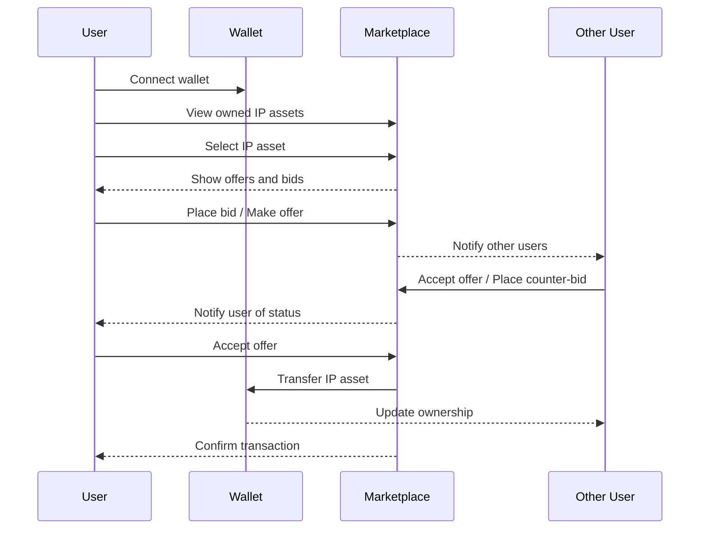

# GeneIP

> **Quick Links:**  
> 📝 [Smart Contract Repository](https://github.com/akbaridria/geneip-contract)  
> 🔄 [dApp Backend Service](https://github.com/akbaridria/geneip-server)

GeneIP is a web application for managing, tracking, and trading intellectual property (IP) assets on the blockchain. It enables users to connect their crypto wallet, visualize IP asset lineage, register new IP assets, and participate in a decentralized marketplace for IP rights.

## Features

- **Wallet Integration:** Connect your crypto wallet to manage your IP assets securely.
- **IP Asset Lineage Visualization:** Explore and trace the lineage and relationships of your IP assets using an interactive graph.
- **Marketplace:** View, accept, and manage offers and bids for your IP assets. Trade IP rights through a decentralized marketplace interface.
- **Asset Management:** List, view, and track your owned IP assets and NFTs.

## Marketplace Flow



## Tech Stack

- **Frontend:** React, TypeScript, Vite
- **Styling:** TailwindCSS
- **Graph Visualization:** @xyflow/react
- **Blockchain Integration:** wagmi, @tomo-inc/tomo-evm-kit
- **UI Components:** Radix UI, Lucide React

## Getting Started

### Prerequisites
- Node.js (v18 or higher recommended)
- Yarn or npm

### Installation

1. Clone the repository:
   ```bash
   git clone <your-repo-url>
   cd geneip
   ```
2. Install dependencies:
   ```bash
   yarn install
   # or
   npm install
   ```

### Development

Start the development server:
```bash
yarn dev
# or
npm run dev
```

The app will be available at `http://localhost:5173` by default.

### Build for Production

To build the app for production:
```bash
yarn build
# or
npm run build
```

To preview the production build:
```bash
yarn preview
# or
npm run preview
```

## Usage

1. Open the app in your browser.
2. Connect your crypto wallet when prompted.
3. View and manage your IP assets from the sidebar.
4. Visualize asset lineage and relationships in the main graph area.
5. Register new IP assets or trade existing ones via offers and bids.

## License

This project is for demonstration and research purposes. Please contact the maintainers for licensing details.
